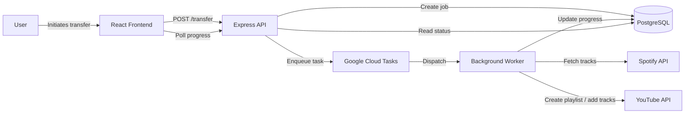

# Mixtape 🎧

Mixtape is a Web App that lets you transfers playlists from one music platform to other, built with scalability and reliability in mind.

## ✨ Key Features

- Asynchronous playlist transfers
- Real-time progress tracking via polling
- Session-based authentication

---

## 🧱 Architecture Overview

- API handles authentication and job creation
- Google Cloud Tasks manages background execution
- Workers process playlist transfers independently



## 🛠️ Tech Stack

### Frontend

- React
- TypeScript
- React Query

### Backend

- Node.js
- Express
- Typescript

### Database

- PostgreSQL
- Prisma (Supabase)

### Infrastructure

- Google Cloud Tasks
- Google Cloud Run
- Docker

---

## 🚀 Project Status

- MVP complete
- Containerization Pending
- Cloud Run deployment Pending

---

## 📌 Why This Project?

This project focuses on **backend architecture tradeoffs**—where simple solutions fail under scale and require more thoughtful system design.

It’s less about moving playlists, and more about building reliable distributed systems.

---
```
